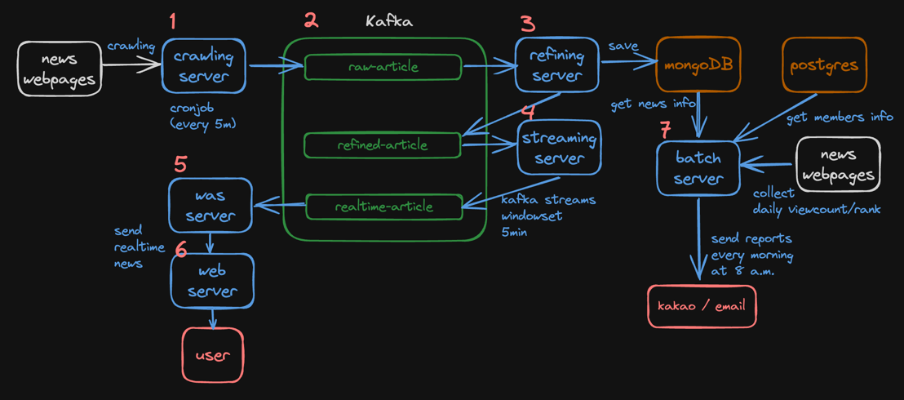
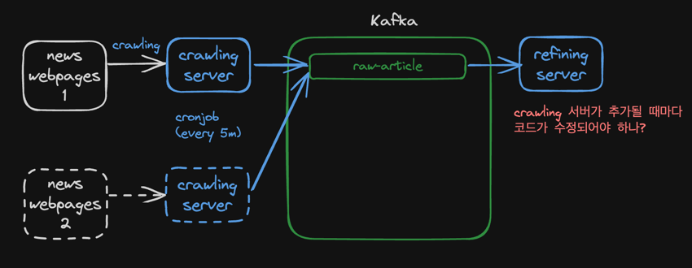
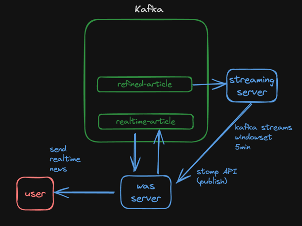
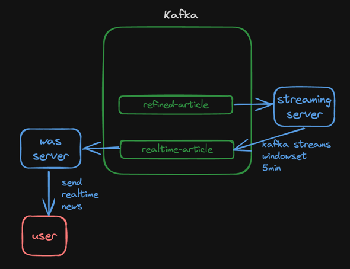

# 0. 사용 기술
 - kotlin/spring, vue.js
 - mongoDB
 - websocket(stomp)
 - kafka
 - kubenetes

# 1. 개요

(*시작하세요! 도커/쿠버네티스 책을 읽고 구현한 k8s 및 이것저것 실습 & 공부*)

**뉴스를 크롤링하고 chatGPT 로 요약해서 일일 단위로 이메일, 카카오톡으로 전송하는 서비스**
- 실시간 뉴스 팝업 기능
- 뉴스 요약 기능
- 일일단위 뉴스 요약 전송 기능 (이메일, 카카오톡)

## 1.1 아이디어
- **특정 동향을 파악하기 위한** 뉴스 모니터링, 뉴스 클리핑 서비스는 많으나, (구글 알리미, 플립보드, 잔디, 디그, 피들리, 스크랩 마스터 등)

- 카카오톡으로 전달하기 위한 하나의 "메시지" 형식으로 만드는 서비스는 없거나 또는 유료임(스크랩 마스터)

- 하지만 소규모 비즈니스, 단체에서는 주로 카카오톡 또는 메신저를 통해 그날 기사를 요약, 전달하는 경우가 많음

  - ```
    ['24. 2. 15.(목), 아침 언론 참고]
    
    <국방(육군) 관련>
    
    ■ 한·미 국방부, 핵협의그룹 주관…北 도발 땐 美 핵무기 공동 운용(서울, 세계, 조선 등)
    https://naver.me/xC17Bo84
    *NCG 제도화·정례화, 방위비 분담금 협상 조기착수 등 ‘트럼프 리스크’ 대비 
    
    ■ 北, 김정일 생일 앞두고 또 순항미사일 발사…올들어 5번째(동아, 서울, 세계 등)
    https://naver.me/GRm4oB1w
    *연초부터 순항미사일 연쇄발사 이례적...기술적 신뢰성 확보 및 ‘러시아 판매용’ 등 관측 
    
    ...
     
    <안보·북한·외교 관련>
    
    ■ 한국, ‘北 형제국’ 쿠바와 전격 수교, 193번째 수교국(전매체)
    https://naver.me/xoY8HsRr
    *외교부 “중남미 정책 대전환 계기”…北 외교적 고립 심화 및 대북 압박전선 강화 기대
    
    ■ 김성한 前 안보실장 “한미, ‘워싱턴 선언’ 당시 한반도 전술핵 재배치 옵션도 논의”(동아)
    https://naver.me/xoY8H6WE
    *NCG창설 및 전술 핵무기 배치 놓고 의견교환…대통령실 “논의한 적 없다” 부인
    
    ...
    ```

- 클리핑 서비스에서 주제에 대한 당일 기사를 가져와도 메시지 형태로 변환하는 작업이 필요함

- 따라서 특정 주제 또는 여러 주제를 입력했을 때 메신저로 만들어주는 뉴스봇이 수요가 있을 것이라고 판단함


# 2. 아키텍처


## 2.1 crawling 서버
- 위치 : article-crawling-server/
- 기술 : python
- 기능
  - 뉴스 크롤링
  - 간단하게 파싱 후 kafka 에 저장

## 2.2 kafka
- 기능 : 카프카

## 2.3 refining 서버
- 위치 : article-refine-server/
- 기술 : kotlin/spring, openAI API
- 기능
  - kafka 에서 뉴스를 가져와서 openAI API 로 요약
  - 요약된 뉴스를 mongoDB 에 저장
  - realtime 스트리밍을 위해 카프카 토픽으로 전송

## 2.4 streaming server
- 위치 : article-realtime-publish-server/
- 기술 : kotlin/spring, kafka streams
- 기능 :
  - 요약된 뉴스를 5분 윈도우셋으로 그룹핑
  - 그룹핑된 뉴스를 kafka 토픽(realtime-article)으로 전송

## 2.5 was server
- 위치 : article-was-server/
- 기술 : kotlin/spring, websocket(stomp)
- 기능 :
  - kafka 토픽(realtime-article) 으로부터 뉴스를 받아서 클라이언트로 전송
  - stomp 으로 양방향 통신

## 2.6 web server
- 위치 : article-web-server/
- 기술 : vue.js
- 기능 :
  - was 서버로부터 뉴스를 받아서 화면에 표시
  - 뉴스 조회

## 2.7 batch server
- 위치 : article-batch-server/
- 기술 : kotlin/spring, spring batch
- 기능 :
  - 하루에 한번 실행되는 배치 (오전 8시)
  - 뉴스 사이트에서 뉴스를 순위별 또는 조회순으로 조회
  - 높은 순위의 뉴스를 mongoDB 에서 조회해서 유저의 이메일, 카카오톡으로 전송

# 3. 실행
- macOS
- docker 설치
- 명령어 실행 위치 : k8s 디렉토리 (깃저장소 루트)

## 3.1 kind 로 클러스터 배포
1. kind, kubectl 설치
- `brew install kind`
- `brew install kubectl`

2. kind 로 클러스터 생성
- `config/kind/kind-start.sh` 실행
  - kind 로 클러스터가 생성됨
- `config/kind/node/kind-nodes.sh` 실행
  - kind 클러스터 노드가 생성됨 (worker 3개)

## 3.2 kafka 설치
- `config/kafka/install-kafka.sh` 실행
    - zookeeper 가 실행됨
    - kafka 가 실행됨 (localhost:9092, 29092) - 로컬용, 도커용 리스너
    - 필요 토픽들이 생성됨

## 3.3 각종 컨테이너 배포
- `confg/k8sfiles/k8s-start.sh` 실행

# 4. 테스트 & 모니터링

# 5.  고민했던 or 챌린지했던 부분

## 5.1 크롤링 서버의 책임
- 크롤링 서버에서는 뉴스를 크롤링하고 파싱해서 kafka 에 저장하고 있음
- 파싱은 html 에서 제목, 내용, 날짜, 태그 등등을 가져오는데 파싱도 하나의 Transform 이라고 볼 수 있음
- Transform 의 책임은 사실 refining 서버에게 더 적합하다고 생각함
- 하지만 해당 Transform 을 refining 서버로 옮기면 다음과 같은 문제점이 있음

### 5.1.1 크롤링 서버가 단순히 html 만 전송할 때 문제점


- 위와 같이 크롤링 대상 서버가 추가 되면 html 파일이 달라져서 결과적으로 파싱하는 방법이 달라짐(네이버 뉴스, 연합 뉴스...)
- 그러면 refining 서버에서는 크롤링 대상 서버에 따라 파싱하는 코드를 추가해야 함 (네이버면 이렇게, 연합이면 저렇게...)
- 반대로 크롤링 서버에서 파싱을 하면 refining 서버는 파싱된 데이터 구조만 알고 있으면 됨 (제목, 내용, 날짜, 태그)

### 5.1.2 결론
- 크롤링 서버는 뉴스 소스 페이지에 따라 늘어날 수 있고, refining 서버는 뉴스 소스 페이지에 따라 변하지 않는 구조로 설계하는 것이 더 좋다고 생각함
- 따라서 크롤링 서버에서 파싱까지 하는 것이 맞다고 생각함
- 사실 refining 서버는 뉴스를 요약하는 역할만 하고 있으므로 crawling 서버가 사실 상 crawling + html refining 을 담당하고 있기도 함

> **추가**
> - 대용량 설계 기초 9장에 웹 크롤러가 나옴. 
> - 거기에서는 웹크롤러의 과부하를 막기 위해 html parser 컴포넌트를 따로 둠
> - 만약 그렇게 한다면 파싱 정보를 DB 에 저장하고 해당 정보를 메모리캐시로 불러와서 사용하는 것도 좋을 듯  

## 5.2 kafka streams

## 5.3 websocket stomp
### 5.3.1 stomp 문제점

원래는 위 구조처럼 사용하고 있었음
- streaming server 에서 5분동안 refined-article 에서 뉴스를 모아서 WAS server 의 STOMP API 로 publish
- WAS server 에서는 STOMP API 로 받은 뉴스를 내부적으로 kafka topic 으로 저장
- WAS server 가 다시 kafka topic 에서 뉴스를 가져와서 클라이언트로 전송

 이렇게 사용한 이유는 WAS server 가 내부적으로 stomp 저장소를 어디로 사용할지 결정할 수 있기 때문임. kafka topic 이 아니라 redis 로 pub/sub 을 구현할 수도 있고 가볍게 인메모리도 사용가능함

 하지만 streaming server <-> was server 간 웹소켓 연결이 간헐적으로 끊기는 현상이 발생했고 하루종일 봤지만 해결하지 못함

## 5.3.2 대안책

어차피 was server 에서는 kafka topic 으로 저장하고 클라이언트로 전송하는 역할만 하면 되므로 streaming server 에서 바로 클라이언트로 전송하는 방법을 사용함.

**장점**
- 구조가 더 간단함
- WAS 서버에서 streaming 서버와 연결할 필요가 없어서 웹소켓 연결에 대한 에러핸들링이 필요없음

**단점**
- 대안책의 문제점은 was server 가 stomp 저장소를 어디로 사용할지 결정할 수 없다는 것임
- 따라서 지금 구조를 유지하더라도, 나중을 위해서 웹소켓 연결이 왜 끊기는지 원인을 찾아야 함
